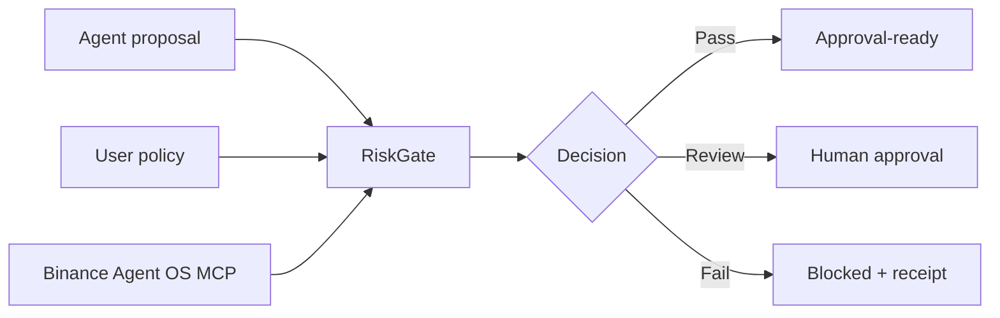

# RiskGate

RiskGate is a safety kernel for AI trading agents. It sits between an agent's proposed action and Binance execution, checks that action against a user-owned policy, and returns one of three decisions: **allow**, **approval required**, or **blocked**.

It does not predict markets, hold funds, or place trades in this MVP.

## The demo

The default scenario makes the point in under a minute:

1. An agent proposes a $12,500 BTC market order.
2. RiskGate requests market evidence from the official Binance Agent OS MCP.
3. The deterministic engine detects order-size, exposure, or slippage breaches.
4. The proposal is blocked before an execution request exists.
5. Switch to the compliant scenario and the same policy returns an approval-ready result.

If Agent OS cannot be reached, the interface uses an explicitly labelled demo snapshot. It never presents fallback data as live.

## Why this shape

Trading strategies are probabilistic; permissions should not be. RiskGate keeps those concerns separate:



The AI layer may translate a plain-English boundary into structured policy. It cannot decide whether a proposal passes. Asset, order size, exposure, leverage, and slippage are evaluated in ordinary TypeScript that can be tested and audited.

## Stack

- Next.js 16, React 19, TypeScript, Tailwind CSS 4
- Official Binance Agent OS MCP over Streamable HTTP
- Cloudflare Workers through OpenNext
- Cloudflare D1 for policy and evaluation receipts
- Any OpenAI-compatible model endpoint for optional policy translation

## Run locally

```bash
npm install
npm run dev
```

Open `http://localhost:3000`. The product works without secrets; it falls back visibly when live Agent OS market data is unavailable.

Optional model configuration:

```bash
cp .env.example .env.local
```

Then set `AI_BASE_URL`, `AI_MODEL`, and `AI_API_KEY`. Do not commit `.env.local`.

## Verify

```bash
npm run typecheck
npm run lint
npm test
npm run build
```

## Cloudflare setup

From a terminal where Wrangler is already authenticated, create the D1 database, copy its returned UUID into `wrangler.jsonc`, apply the migration, then deploy:

```bash
npm run cf:whoami
npm run cf:d1:create
npm run db:migrate:remote
npm run deploy
```

The first migration is in `migrations/0001_initial.sql`. `weur` is used as the location hint for lower latency from West Africa. If `riskgate-db` already exists, run `npx wrangler d1 list`, copy its UUID instead of creating a duplicate, and continue with the migration.

After deployment, test both scenarios and confirm the decision receipt says `Saved to D1`. `npm run cf:tail` streams production errors while you test. The app treats receipt persistence as best-effort so local development remains usable without D1.

### Optional live Binance Agent OS evidence

RiskGate starts with explicit **Demo evidence**. To connect live, read-only Agent OS evidence, set two production secrets in Cloudflare: `BINANCE_OAUTH_ENCRYPTION_KEY` (a random 32-byte base64url key) and `BINANCE_CONNECT_ADMIN_TOKEN` (a long random owner-only value). Neither belongs in `wrangler.jsonc`, Git, or a browser URL.

With the same admin value in a local environment variable, start the connection from your own terminal:

```bash
$env:RISKGATE_ADMIN_TOKEN = "your-owner-only-value"
npm run binance:connect
```

Open the printed one-time URL, complete Binance OAuth, then return to RiskGate. The encrypted access token is stored in D1 and used only for market-data MCP calls. No trade, order-placement, cancel, balance, or execution tool is called. If the token is missing, expired, or Agent OS fails, the product remains in its clearly labelled demo fallback.

## Safety boundaries

- Read-only market data is the default Agent OS capability used by the demo.
- The MVP never calls a trade-execution tool.
- A failure to fetch live evidence cannot silently become permission to act.
- Every result includes its evidence source and rule-by-rule outcome.

RiskGate is hackathon software, not financial advice or a production risk system. Do not use money needed for rent, bills, or emergencies for trading.
